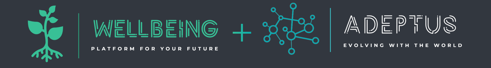

# 🌿 Wellbeing API




---

 


A **Wellbeing API** é uma API REST voltada para **saúde mental**, alinhada ao **ODS 3: Saúde e Bem-Estar**. Ela oferece um conjunto completo de funcionalidades, incluindo gerenciamento de pacientes, registros diários de bem-estar, consultas, profissionais de saúde, especialidades, condições do paciente e conteúdos de apoio.

O objetivo central é promover o bem-estar mental por meio de soluções tecnológicas acessíveis, eficazes e integradas ao cotidiano do usuário. Futuramente, a plataforma contará também com um **website próprio**, ampliando a facilidade de acesso e interação.

Este projeto foi desenvolvido em parceria com o **Adeptus**, um site e aplicativo dedicado à requalificação profissional. Dessa forma, a Wellbeing API se integra ao ecossistema do Adeptus para oferecer **suporte completo à saúde mental** dos seus usuários, fortalecendo o cuidado emocional durante sua jornada de desenvolvimento profissional.

------------------------------------------------------------------------

## ✨ Sumário

-   [Grupo](#-grupo)
-   [Visão Geral](#-visão-geral)
-   [Como Executar](#-como-executar)
-   [Arquitetura e Estrutura do
    Código](#-arquitetura-e-estrutura-do-código)
-   [Dependências](#-dependências)
-   [Endpoints da API](#-endpoints-da-api)
-   [Postman](#-postman)
-   [Segurança](#-segurança)
-   [Seções Avançadas](#-seções-avançadas)
    -   [Modelagem ER](#modelagem-er)
    -   [Decisões de Arquitetura](#decisões-de-arquitetura)
    -   [Futuras Expansões](#futuras-expansões)
-   [Links Úteis](#-links-úteis)

------------------------------------------------------------------------

## 👥 Grupo

- **Alice Santos Bulhões:** RM554499
- **Eduardo Oliveira Cardoso Madid:** RM556349

------------------------------------------------------------------------

## 🔎 Visão Geral

-   ☕ **Java:** 17+
-   🌱 **Spring Boot:** 3.5.7
-   🔗 **Base URL:** `http://localhost:8080`
-   📘 **Swagger:** `/swagger-ui/index.html`
-   🗄️ **H2 Console:** `/h2-console`

------------------------------------------------------------------------

## 🚀 Como Executar

``` bash
./mvnw test               # Rodar testes
./mvnw spring-boot:run    # Rodar API (H2)
./mvnw spring-boot:run -Dspring-boot.run.profiles=prod  # Rodar API (MySQL)
```

------------------------------------------------------------------------

## 🧱 Arquitetura e Estrutura do Código

    src/main/java/com/globalsolution/wellbeing_api
    ├── controller/      # Endpoints REST
    ├── service/         # Regras de negócio
    ├── repository/      # Persistência
    ├── domain/          # Models, DTOs, Exceptions
    └── mapper/          # Conversões Entity ↔ DTO

------------------------------------------------------------------------

## 📦 Dependências

-   Spring Web
-   Spring Data JPA
-   Spring Validation
-   Spring Security
-   SpringDoc OpenAPI
-   H2 (dev)
-   MySQL connector (prod)
-   Lombok

------------------------------------------------------------------------

## 🔍 Endpoints da API

### 👤 Pacientes

-   `GET /pacientes`
-   `POST /pacientes`
-   `PUT /pacientes/{id}`
-   `DELETE /pacientes/{id}`

### 📓 Registros Diários

-   `GET /pacientes/{id}/registros`
-   `POST /pacientes/{id}/registros`

### 👩‍⚕️ Profissionais

-   `GET /profissionais`
-   `POST /profissionais`

### 🧠 Especialidades

-   `GET /especialidades`
-   `POST /especialidades`

### 📅 Consultas

-   `GET /consultas`
-   `POST /consultas`

### ❤️ Condições do Paciente

-   `GET /pacientes/{id}/condicoes`
-   `POST /pacientes/{id}/condicoes`

### 📚 Recursos de Apoio

-   `GET /recursos`
-   `POST /recursos`

------------------------------------------------------------------------

## 🧪 Postman

Coleção disponível em:
`postman/wellbeing-api.postman_collection.json`

------------------------------------------------------------------------

## 🔐 Segurança

-   🔓 Dev: Acesso liberado
-   🔒 Prod: JWT recomendado, CORS restrito e perfis configuráveis

------------------------------------------------------------------------

## 🧬 Seções Avançadas

### Modelagem ER

    Paciente 1---N Condição
    Paciente 1---N Registro Diário
    Paciente 1---N Consulta N---1 Profissional
    Profissional N---N Especialidade
    Profissional 1---N Recurso de Apoio

### Decisões de Arquitetura

-   DTOs para isolamento do domínio
-   Services para centralizar regras
-   Mappers para remover duplicação
-   PERFIS: `dev` (H2) e `prod` (MySQL)

### Futuras Expansões

-   Autenticação completa (JWT)
-   Sistema de indicadores emocionais
-   Dashboard com analytics
-   Notificações e lembretes

------------------------------------------------------------------------

## 🔗 Links Úteis

-   📘 Swagger UI
    `http://localhost:8080/swagger-ui/index.html`

-   🗄️ H2 Console
    `http://localhost:8080/h2-console`

-   🖥️ Github
    `https://github.com/L-A-N-E/Wellbeing_API/`


